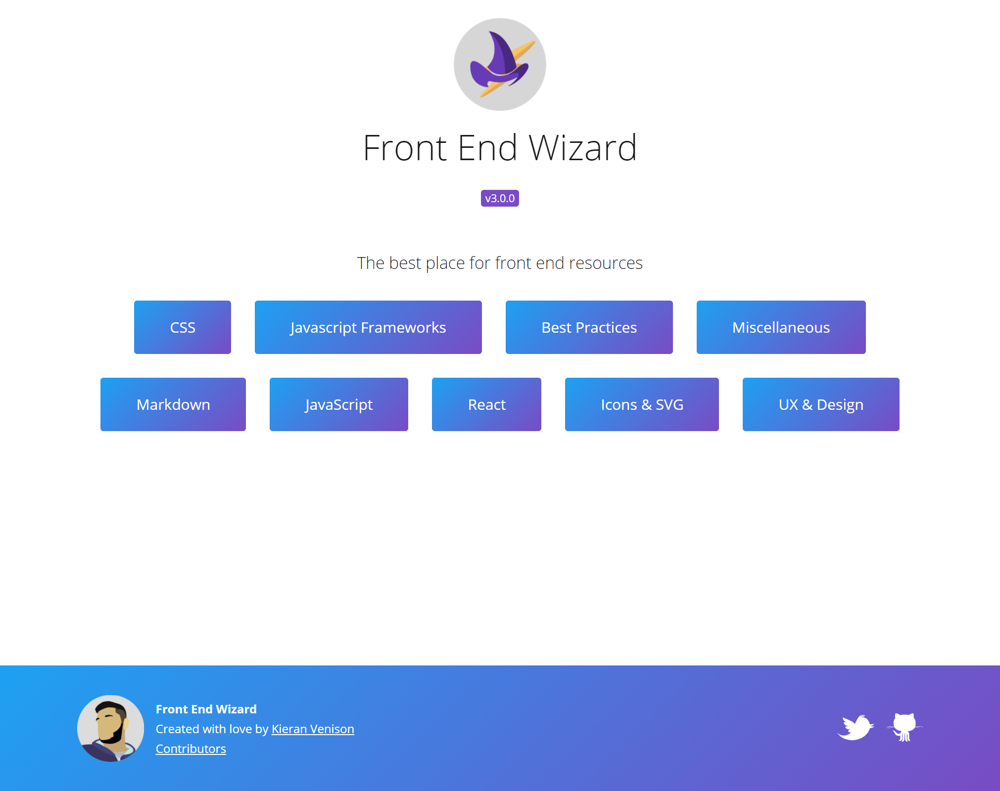
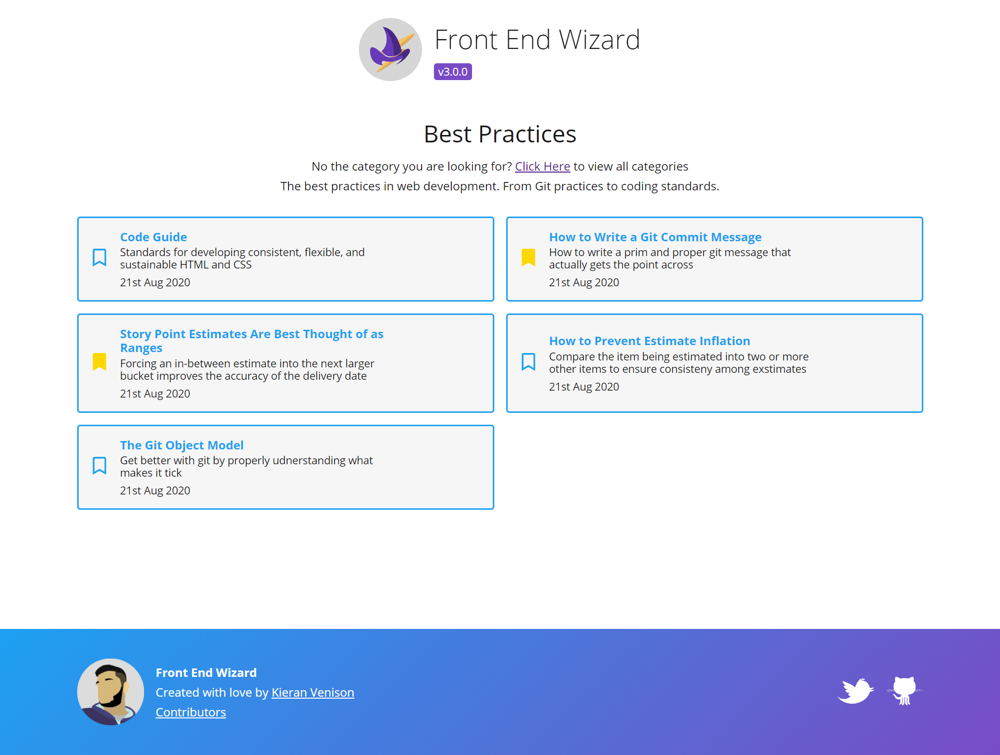

Hi all. Last night, just before midnight, I released the rebuild of <a href="https://www.frontendwiz.co.uk" target="_blank">Front End Wizard!</a> For the last 5 weeks I have been working on rebuilding Front End Wizard from the ground up. I decided to do this because it was my first React project and it was very, very messy.

And yes I did a Friday release at midnight, what could go wrong 😂. (turns out it was DNS things, but we are past that now).

## What's New?
So things have changed a lot from the last version. I have added some features, and I have removed some features.

**What's been added:**

- Bookmarking posts. This is entirely local storage based, so you won't have your bookmarks on other devices just the one you bookmarked them on. I did it this way because I didn't want users to have to create an account just to save some links.
- Landing page. The landing page is now a list of categories rather than every link on the site. This was done to reduce confusion when trying to find a specific topic.
- Splitting out category pages. As the new landing page is now dedicated to showing all the categories each category has its own page. This means when you view a category you don't have the clutter of everything else.
- Added a version history page you can get to by clicking the version number and added a contributor page accessible in the footer!

 Below you can see an example of the bookmarks

**What's been removed:**

- Most of the links! I removed most of the links as a reset and have started building them back up to ensure the links are still valid content. By valid I mean the links are not dead, and the content is still valid in 2020.
- Search bar (from all pages). With removing most of the links and splitting out the categories the search bar at the moment is a bit of an overkill. This may come back eventually but for now it will remain in slumber.

## What did I build it with

Front End Wizard is now 2 separate projects. An API project, and a Front end project. The reason I split them out is that having all the data in json files was getting unwieldy and hard to maintain, I needed a database.

**Front End Project:**

<a href="https://github.com/kieranmv95/Front-End-Wizard" target="_blank">Click here to see GitHub project</a>

- ParcelJS for bundling. Started playing about with this just before I started the project, and it was so fast and easy to set up I had to use it.
- ReactJS (At the time of writing at V16). I initially built this with React so rebuilding it with a couple years more React experience was a big part of this rebuild for me.
- TypeScript. I have been meaning to look into TypeScript for years so I finally bit the bullet and decided the time will be now!
- Redux for my state management
- Sass for my styles
- Hosted on netlify. Its free and its fast! 

**Back End Project**

<a href="https://github.com/kieranmv95/Front-End-Wizard-API" target="_blank">Click here to see GitHub project</a>

- NodeJS. I wanted to keep everything in the JS ecosystem for this project and NodeJS was ideal for it anyway.
- TypeScript. Again I wanted to learn TS so I used it for this project. It actually really helped with the project having the data contracts available! 
- ExpressJS
- MongoDB for the database. I like MongoDB, and personally it seemed ideal for what will end up being a large dump of links!
 
## What's to come?

I have lots of plans for the future, so I do not know where to start. The things that I am currently thinking about doing in the future include:

- Introducing the ability for users to locally hide links they don't care for
- Introducing a random link or link of the day style feature
- Introducing an all links page with pagination.
- Re-introducing the search functionality when links get unwieldy 

## Got some links you want adding?

I only want to add links of things that are good enough to make the cut! If you know of a resource that's not on the site that you think must be. <a href="https://twitter.com/kieranmv95" target="_blank">Drop me a tweet</a> or raise an <a href="https://github.com/kieranmv95/Front-End-Wizard" target="_blank">issue on the repo!</a>  