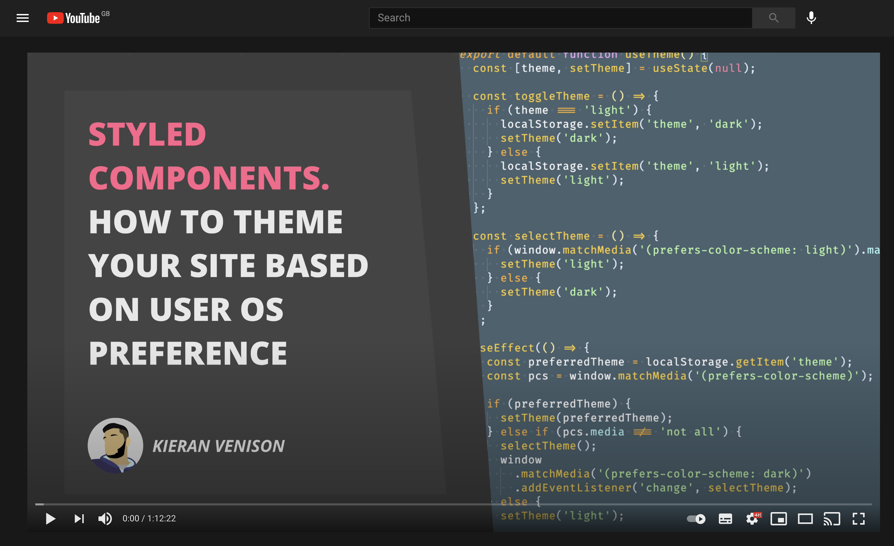

## Content Creation

### Intro/why?

This year I have started my journey into the content creation world. But why?

I primarily started creating content around frontend development for YouTube to help people on topics they may be stuck on and to get better at teaching. That being said, I also wanted to use it as a form of documentation for things I have done in the past, a place where my guides can live.

I am a very visual learner. I have always learned by watching videos. There are lots of people who learn in a similar way to me. I love to read, but as soon as it comes to a technical books my brain shuts down, I find it really hard to follow. I need to see and do.

By creating videos I can look back and see my thought process as I create things and follow much better than reading notes from months back. If even one person happens to get any use out of these videos I consider them successful!

### The First Video

The first video was actually nerve racking. I will get better with time but I was genuinely nervous. And I have talked in front of hundreds of people before (I was nervous then too). I think I was more nervous recording the video!

I had my predefined topic (Styled Components) and a loose bullet pointed list of what I needed to cover as I went through. It kind of looked like this:

- Introduce myself and run over the project we will be creating
- Setup project and install deps
- Setup styled components
- Show parcel
- Add normalize
- Setup theme providers
- And much more

The plan was a single take video to cover the creation and any mistakes so devs can see what I do to debug in the real world.

I didn't realise when I started the video was going to be over an hour long, A really thirsty hour when you start nervous and forget to make a drink.

The first take was 5 minutes then I scrapped it, the second take was 20 minutes then I scrapped it.

The third take I said lets just go with it, any mistakes and freeze ups are being left in, otherwise it will never get done. So I recorded the full hour and 12 minute video using OBS studio and called it a day on the recording front. Once the recording was done I ran it through iMovie with the thumbnail at the start and some cringy generic learning background music and started processing the video.

Once I had done that I started uploading it to YouTube.

The video quality was good, The audio quality was... meh, the content was (hopefully) satisfactory. It could have been much better, but thats iteration baby. My freeze ups and moments of confusion could have been less frequent and cut out of the video in post. But in my eyes the freeze ups and issues are a part of development, so they are staying in! The main thing was although I was only somewhat happy with it, it went onto YouTube, its a start!

### What did I learn / Tips

During and after recording I have learned a lot about what to do going forward! But there's a hell of a lot left to learn. These are the things I realised myself, or friends pointed out to me after. They might help you if you are about to step into the world of content creation!

- **Just do it**. Any content is better than no content. I was tempted to not bother after the first few failed takes. I then got past that and decided whatever happens on the next one, its going live. This might sound bad but if you give up on the first hurdle, you are likely never going to continue. Having something up is better than nothing at all, it will make you strive to do better next time!
- **Screen size / Scaling**. I recorded in 4k on a 32 inch screen. I pre-emptively scaled up the font sizes in vs code and that worked partially but it wasn't enough. It is watchable in at least HD but a friend pointed out that when possible he likes to split out a mini viewer so he can follow along whilst watching on the same screen. Next time I am going to scale up the font size more and the actual code editor itself so its easier to see the UI on a smaller screen.
- **Screen real estate**. I only have so much space on the single screen I record from, so I need to maximise what I use it for. The entire video had a 50:50 split of editor and chrome to view the webapp. In theory this was cool because it let you see the hot reloading and quickly check the progress. The issue with doing this is stuff was more compressed as a result of trying to fit more onto one screen. If I made vs code full screen and tabbed between code and chrome I could have scaled both the windows up and made it more accessible for users. So in the future that will be something I do.
- **Audio**. I recorded the audio on my mac microphone. Its an okay mic but it picked up a lot of background static and a bit too much bass in my voice so it sounds a bit funky. Next time im going to try my gaming headset and see how that goes. If its still bad I might look into further upgrades.
- **Webcam**. Last but not least, my thumbnail video. It desyncs in and out of the video and my lips don't line up with what I'm saying. It doesn't cause any real issues as its still in time with what I am doing code wise its just a little distracting. I was tempted to turn off the webcam for the next video but my friend said its nice because it feels a bit more like your being tutored when you see someone. So until i figure out a fix for the desync I am jsut going to have it on for the into and outro when introducing the project and thanking people for watching.I think this way it gives me even more screen space during the video to focus on the code.
- **Thumbnail**. Make a nice thumbnail! It doesn't have to be anything special but you want to be able to identify what the video is even when the thumbnail is small. Thats why I did a big old block font text on the thumbnail. I used <a href="https://www.designer.io/en/" target="_blank" rel="noreferrer">Gravit.IO</a> to make it for free, its a really simple online tool!

### Uploading / Rendering

I Used iMovie to render the video once recorded. This takes a lot of time. An hour and 50 minutes to be precise, but it is a 4k, hour and fitfteen minute video after all so thats expected.

What I didnt expect was YouTube to take about 1 hour to load the SD version (which is just unusable because of the font size). About 4 hours for the HD version, and nearly **20 Hours** for the 4k version.

This meant my video was live for 3 hours in SD, looking absolutely horrendous with no options to bump up the quality, You couldn't see the text clear enough to even follow along. Next time I am going to upload it but delay the video going live until YouTube has processed all the HD versions. This way it prevents that user experience drop of people viewing a really really low quality video and thinking that that was the complete thing.

### Iteration

I have this large list of points to consider for next time, and no doubt it will get larger before it goes down! However making this first set of changes will drastically improve the quality of my videos. That being said I know this is a journey which will never be complete. Every video will have improvements and as long as I iterate each one in the right direction I should eventually be making great content! So a bad video (like my first one) is not a problem, you can look back at that in the future and see how much better you get.

### Shameless plug time

If you have made it this far, please check out the video this article is based on (bearing in mind its my first):

`youtube:https://www.youtube.com/embed/30F-yfcj-CE`

If you like that and want to se more, check out the <a href="https://www.youtube.com/channel/UCxX-3WG1vKNVJjGi2mwRziQ" target="_blank" rel="noreferrer">Channel</a>.
