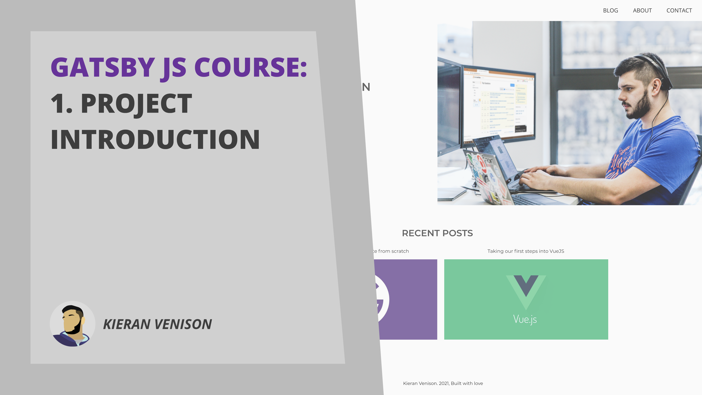

## It's live

Hi All, Today I'm launching my new <a href="https://youtu.be/F7C3IQo4HqU" target="_blank" rel="noreferrer">GatsbyJS course</a>. This course aims to teach you how to use GatsbyJS to build a real world website. In the project we will be building a personal portfolio/blog website.

The website will feature a home page, about page, contact page, blog and article pages.

The first video is a project intro video explaining what you will be building. The videos are going to be released every couple of days whilst I continue to create and edit the videos. I thought it was better to get it out as soon as possible rather than dropping it all at once.

## What will you learn

Theres a large list of topics that will be covered in this series but heres a few of the things you can expect:

<ul class="rocket-list">
  <li>Setting up a Gatsby project</li>
  <li>Setting up styled components</li>
  <li>Handling SEO to get that pagespeed sky high</li>
  <li>Using contentful to dynamically create article pages</li>
  <li>How to leverage GraphQL in gatsby</li>
  <li>And much muych more!</li>
</ul>

## When does it start?

First, have a look at the into <a href="https://youtu.be/F7C3IQo4HqU" target="_blank" rel="noreferrer">video on YouTube</a>

If the project looks like it will be good for you then get ready! Expect the next video in the next couple of days followed by frequent releases of more videos!

I hope you look forward to learning GatsbyJS, I look forward to teaching it!