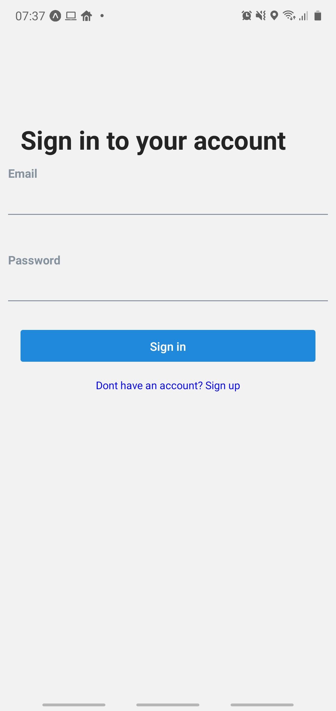
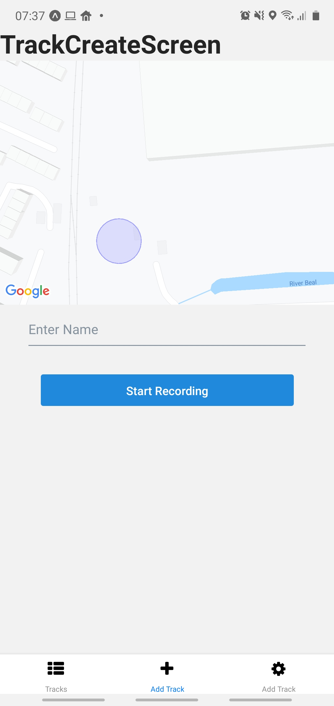
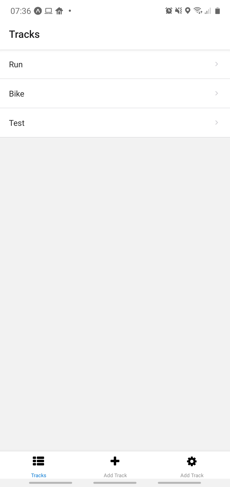
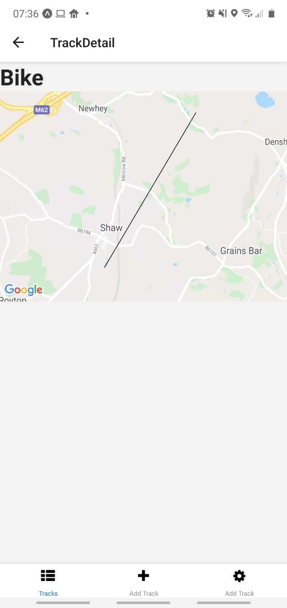

## A week in words

Somehow I did it, if you read my blog post last week you would see that I wanted to power through a tutorial thats just over 7 hours for this week. And I literally finished it last night.

I have done a lot of planning this week for my secret project and have fallen in love with Miro to do so! 

## Project Chat

This week the focus has again been training up on React Native. There has been work on the Secret project I am building but no actual code at this stage.

### React Native - Week 5 

So a week-long slog to get through the 7 hours of tutorial video and build a working application.

It paid off. I built a small application for tracking a users location and drawing it onto a map. Using the express API I built the previous week I got it all hooked up to a front-end.

My front-end was built using the following packages worth mentioning:

- react-navigation (5.x.x): Although the tutorial was using v4 I decided to up the challenge I would use the new implementation of react navigation.
- axios: I like axios, I find it makes the request side much easier, so I usually plug this into my projects regardless.
- react-native-elements: This provides some default components like Text and ListItems that are pre-styled, so I could just focus on the React side of the project.
- react-native-maps: for displaying the maps and drawing the points
- expo-location: for all the location tracking things
- @react-native-community/async-storage: For storing the JWT token when the application is closed
- context api: Although not a package all of my applications state was using the default react Context API, as a learning experience and memory refresher.
 
The above packages pretty much make up this application. the application consists of a sigup/in screen, a page to track a route, a page to list all routes and an account page to log out from, so it is a relatively simple structure.

In the screenshots you may notice that the tracking line goes directly straight and does not follow the actual streets, its not a bug I promise. It's due to mocking the location data, so I didn't have to go out on a real walk! With that in mind here is the final application:

    

        
    

    

        
    

    

        
    

    

        
    
    

It's rough and ready, but it works and is my first mobile application. Next week I will be continuing to fine tune my React Native skills!

### Top secret project planning?

Hopefully, as of next week, this won't be a secret project, It's only a secret project whilst I plan it out. I will be more than happy to share the idea with the world once the idea is solidified!

So what have I been doing? I have been planning it all out in <a href="https://miro.com/" target="_blank">Miro</a>. Miro is an online whiteboard style tool where you can throw post it notes write down ideas and pretty much do anything you want! I would highly recommend trying it out.

I used Miro to build up a page structure of what my application is going to look like. I used a post it note to represent each page and then built up a hierarchical view. Only simple names and not much more detail. Now that I have got the pages listed out I can start planning how to navigate between them and what the journeys are going to look like. Once this is out of planning stage I will do a more complete write up of how I did the planning phase using Miro.

Once I had the page structure done I started creating a post it to represent each piece of data I might need for the application to get a feel for what the API was going to need going forward.

That leaves me up to now. Still, a lot of planning and mock-ups and designs but making good head way.

If I have not mentioned yet the big uptick in learning React Native is directly to build this as it's going to be a mobile app that I do plan to release in the future so keep an eye on this space!

## Week Coding Breakdown

Check out <a href="https://wakatime.com/" target="_blank">Wakatime</a> to find out what your coding breakdown is!

Coding stats for the last 7 days `(usage > 5%)`:

|Language|Percentage|Description|
|---|---|---|
|.js|**92%**|So much React Native / express / javascript in general|
|.md|**5%**||

## Off topic

The weddings on! Again... So, for the third time my wedding has changed. Originally supposed to be in sunny Cyprus in the wedding capitol of Paphos, that got cancelled when thomas cook went bump. The second time coronavirus showed up, resulting in us moving it to mid next year! Now we have made the decision, due to coronavirus again, to just do it ASAP. This decision was made because its not going away any time soon and after the years of stress we just want to be married! So as of November I will be a married man. Its been a stressful 2 years of things going wrong with weddings and its about time we got married.

To anyone who has planned a wedding before, I understand your pain, its bloody stressful.

Other than re-planning the re-planned wedding, It's been relaxing and VR, although I think a driving range visit is long overdue to let off some real steam.

