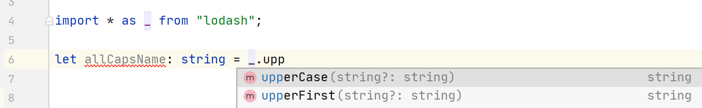

## A week in words

I have spent a good chunk of my week blitzing through the PluralSight TypeScript Core Language path this week because I want to start working on my projects. I have set the goal to at least get near finishing something before moving on!

Other than trying to get as much of the PluralSight course out of the way I have started planning out what the new Front End Wizard project is going to look like, See more in the Project chat section. 

## TypeScript (Week 3)

The third week of learning TypeScript, I have easily done twice as much this week than I have in the past weeks. It's starting to get much more comfortable now.

I have started looking at generics, enums, async await typescript code and looking at OO concepts in general. Before I continue though here's a mini guide on something I never knew before!     

Before this week I had seen plenty of `.d.ts` files across projects in the past but never really knew what they were used for. Now I know that a .d.ts file is a deceleration file. These are full of typings for things such as third party libraries. Most third party libraries supply typescript declaration files themselves due to the popularity of TypeScript but if they do not you have an option! 

### Installing a libraries typings

I used <a href="https://www.microsoft.github.io/TypeSearch" target="_blank">Microsoft TypeSearch</a> to find the typings for a library. In this example we will do lodash.

First I need to install lodash into my project

`npm i --save lodash`

Once lodash is installed I can search for lodash on <a href="https://www.microsoft.github.io/TypeSearch" target="_blank">Microsoft TypeSearch</a> and get the NPM package name from there to install lodash as follows.

`npm i --save-dev @types/lodash`

Once we have all the prerequisites install we can use lodash in the project by importing it into a file 

```typescript
// app.ts
import * as _ from "lodash"
```

Now we are using lodash inside the project, and it has the type declarations pulled down from npm everything is done! It really is this simple. Now when you start typing `_.` you will get code completion for all the lodash available functions! Furthermore you will also have the type information about the function! Check it out below.


   
### But wait... There's more

There is more, and it is somewhat related to TypeScript. A lot of the work spent learning TypeScript in the last week has not been so much in coding but more in understanding a list of concepts in Object Oriented Programming. I already had an idea of the concepts but I needed to solidify them as I dont often use them, because I usually don't use TypeScript!

I'm not going to show you the concept as theres a millon articles on google that can explain OOP better than I can but some of the things I covered are as follows:

- Abstraction
- Encapsulation
- Inheritance
- Polymorphism

Other than that I am now ready to start taking the next steps. Using TypeScript in React! We will see next week how this goes.
 
## Remote working during COVID

For the last 5 months I, like most people, have been working from home. After 5 months I have now got a good grasp on what has been working and what hasn't when it comes to productivity. Most people who have been in the same boat as me probably already know these things but I thought it would be worth sharing anyway, in case it can help at least one person! Here's my personal 7 commandments from working from home.

### 1. Have a goal

Each morning I set myself a goal. This gives me something to aim towards and know that if I complete the goal it's been a successful day. The goals don't need to be complicated, the simpler the better. Usually a days goal looks like the following:

- Get task A and B from QA into Done Today
- Finish Task C development today and raise a PR
- Pick up task D from backlog and start on that  

Really simple goals that are either true or false so at the end of each day I know if it has been done or not been done and what I need to carry over into the next day.

One additional benefit to this is that if you do daily standups you already know your exact standing because you are tracking it with these goals. 

### 2. Dress Appropriately

I do not mean put on a shirt and tie or don your best suit, And it's a good job I don't because I only own 2 suits, my wedding suit and my birthday suit.

I mean wear fresh clean clothes daily and don't put on things you would not to work.

I wouldn't go to work in my dressign gown so why would I wear it when working from home? If you dress in your lazing about comfort clothes I feel like it reflects in how you perform, It does for me at least! 

### 3. Try and have a seperate space

I know this is not possible for everyone because it entirely depends on having the spare space. If at all possible set up and area to work at (and try to avoid the bedroom, reserve this room for winding down).

I have a spare room, so I have set that up as an office room. It helps break me away from the rest of the house and is my dedicated place to focus. If you don't have a spare room try to use a dining table if possible and set up a desk space similar to how you would at work.

I find this helps me stay focused and helps me avoid distraction. 

### 4. Take breaks

You take breaks at work, probably more than you realise. At the start of lockdown I was working the entire day. 8 - 4 non-stop with some time to grab a sandwich in the middle.

It made sense to do that. Until I started to get burned out after only a week or two. I needed micro-breaks. In a normal office environment you have lots of breaks. You go to meetings, you grab coffee's and you have general chit chat with colleagues which help break up the day. Without these micro breaks your day can drag and feel very repetetive and robotic.

To mitigate this you simply need to take more breaks. Take a small amount of time away from your PC every so often just to break away and reset.

I pop downstairs and do a household task like wipe down the surfaces or sort the dishwasher out. Or read 5 minutes of a magazine. Any task that helps your brain have a few moments of rest.     

### 5. Get out in the morning

I don't do this every morning just when I feel I need to. Popping out for a walk really helps. I used to have to commute to work. My old journey was a short walk then the tram then another short walk. In my working week this was a lot of the movement I did, its bad isn't it!

Getting out for a walk in the morning just ensures that I am not spending every second of the day completely sedentary. If not for any real health benefits it makes you feel better knowing that you have done something rather than nothing!  

### 6. Planning Meals In Advance

The first few weeks I was really bad when it comes to food. **Really bad**. I had a mixture of Just eat and Uber eats nearly exclusively for 2 weeks then I realised that I had to stop it.

I started planning my meals in advance. Nothing special, just ensuring I had some porridge pots for breakfast and either some shakes of sandwich items for lunch.

Doing this meant I was prepared each day and could avoid junk food. 

### 7. Get a whiteboard

Not essential at all, I just found this pretty useful. Whenever something comes up I throw it on the whiteboard, simple. I usually do this until the boards getting pretty full and then action on all the notes I have thrown on it.

Its handy because its directly in front of me, so I can quickly see a list of things I need to do, people I need to catch up with etc.

And that's it. Its only a few things that helped me but if it helps you at all then great! I'm still learning as I go to.   

## 8. Project Chat

I'm sort of kicking off the Front end wizard project that I have been mentioning the past couple of weeks. There will be no code (at least this week) yet but I have finally started properly planning the project out. I decided to plan through trello and make it a [public board](https://trello.com/b/aIKttr7S/front-end-wizard) So people can see the progress before the new version goes live. The only things I really know at this stage are:

- Its a full rebuild
- It will be using React with TypeScript for the FE (BE TBC) 
- It will pull the links down from an API rather than the current json file
- It will have a way for the users to favourite links   

Other than the above and continuing my TypeScript journey, that's all for project chat!

## Week Coding Breakdown

Check out <a href="https://wakatime.com/" target="_blank">Wakatime</a> to find out what your coding breakdown is!

Unfortunately WakaTime had a couple of issues in the last few days, so I lost a lot of the tracking which would have been on TypeScript 😭

Coding stats for the last 7 days (where usage was over 5%):

|Language|Percentage|Description|
|---|---|---|
|.jsx|**32%**|Getting close to a release at work so been spending a lot of time in jsx at the moment|
|.ts|**17%**|Up-skilling in Typescript|
|.css|**12%**|Work related React Projects|
|.js|**13%**|Skimming through the output TyeScript files to see what the compilation looks like|

## Hot picks

Every week I pick out a few cool resources I have recently found and share them here! 

- <a href="https://javascript30.com/" target="_blank">WesBos Javascipt 30</a> - A free, 30 day vanilla JavaScript coding challenge. Build 30 things in 30 days! 
- <a href="https://github.com/getify/You-Dont-Know-JS" target="_blank">You Don't Know JS</a> - A **FREE** series of books diving deep into the core mechanisms of the JavaScript language. One of the best book series I have ever read! 

## Off topic

Had a fantastic week this time round, got to catch up with a friend at the weekend and watch the best/worst film ever made. Starship troopers!

Had a nice meal on Sunday at a local cafe that has reopened, its dog friendly too so I could take the puppers round, I have a 5-month-old cockapoo, he is so cute.

Ordered some golf clubs of my own so I can stop borrowing my friends!

Other than having a somewhat normal weekend I have actually managed to get a lot of work done both on personal projects and up-skilling.   