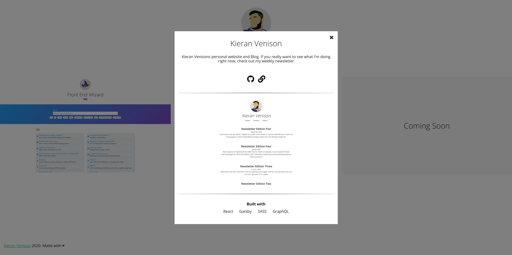
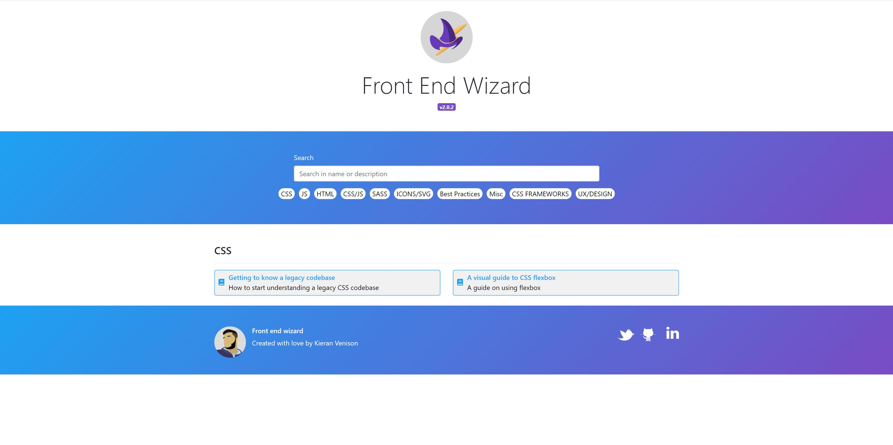
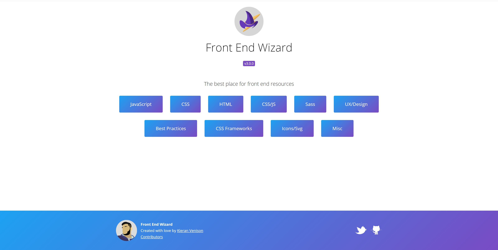

## A week in words  

This week I have really been playing around. Like I said last week, I got the <a href="https://venison.dev" target="_blank">venison.dev</a> project underway and completed in a day, using a new tech (more below). I also managed to make some good progress on Front End Wizard. However I'm still unsure about release date at this time, there's a lot to do yet!

## Project Chat   

Welcome to the weekly project chat. This week we have venison.dev and Front end wizard.

### Venison.dev - Lets Talk SvelteJS



This week I figured I might as well build the <a href="https://venison.dev" target="_blank">venison.dev</a> project. If you didn't read <a href="/newsletter/2020/newsletter-5/">last weeks newsletter</a>, venison.dev is a domain I have been sitting on for ages and not known what to put on it. The idea was to use venison.dev as a simple showcase site. Now its live. Still a few minor issues to fix, but it's a start.

I decided to build a minimal UI project showcase. <a href="https://venison.dev" target="_blank">Check it out</a>. I decided, like Front End Wizard, to use ParcelJS to bundle everything because I am in love with it at the moment. It's so simple and fast! I also decided to use <a href="https://svelte.dev/" target="_blank">Svelte</a>.

Svelte is similar to Vue in the fact that everything a component needs is in the same file. Like below:

```html
<script>
    let name = 'Example'
</script>

<style>
    .title {
        color: rebeccapurple;
    }
</style>

<h1 class="title">Hi, {name}</h1>
```

I was going to use React originally as it's my goto but I figured being such a small project I should do something different. I originally started using VanillaJS and then quickly diverted to using Svelt.

I switched because I very quickly found myself missing the quick looping over an array to display components that a framework like Svelt provides you, and the footprint and setup is so much smaller than React. And yes I know you can do this in VanillaJS but, I wanted to use something new 🤷‍♂️

The site itself is extremely minimal and in terms of Svelte components it consists of:

- App (the main entry point)
- Header 
- Footer
- Project Component (to display each individual project)
- Popup (for the project details)
- Button Component

Only using it for one day for one project I have had nowhere near the time to decide real opinions on it but here are my first thoughts.

😊 I like the way that Svelte handles looping over arrays and if statements:

```html
<script>
    import ShowColor from "./ShowColor.svelte";
    import ColorPicker from "./ColorPicker.svelte";

    let colors = ['red', 'purple', 'green'];
    let showColorPicker = false;
</script>

<div>
    {#each colors as color}
        <ShowColor {color} />
    {/each}
    
    {#if showColorPicker}
        <ColorPicker />
    {/if}
</div>    
``` 

😊 I like the way that Svelte has slots for handling children

```html
//Button.Svelte

<script>
    export let handleClick;    
</script>

<button on:click={handleClick}>
    <slot />
</button>
```

Now anything you put between the `<Button></Button>` tag is rendered into the slot on the button. Slots can also be <a href="https://svelte.dev/tutorial/named-slots" target="_blank">named</a> making them super powerful!

😊 It was simple enough for me to build and deploy in a single day, so they are doing something correct.

😟 I'm still not sure yet if I like the script, style and html in one component, but I think that would grow on me.

First thoughts aside I have only used Svelte for one day, I have probably made a lot of mistakes (especially when it comes to the global state management in `Popup.svelte` file). So feel to check it out and criticise on <a href="https://github.com/kieranmv95/venison-dev" target="_blank">GitHub</a>!

If you want to play about with Svelte yourself you should check out <a href="https://svelte.dev/tutorial/basics" target="_blank">Svelts tutorials</a> as they are fantastic, and interactive!

If you wanna get straight in and dirty follow Svelts setup guide or jump in with ParcelJS setup which you can find on the <a href="https://parceljs.org/recipes.html" target="_blank">recipes page</a> 
 
  

### Front End Wizard

This week I made good progress on the front end wizard rebuild <a href="https://trello.com/b/aIKttr7S/front-end-wizard" target="_blank">Check out the trello</a>.

I moved most of the small style tickets over before getting the bulk of the logic started. Currently, all the links live in json files in the root of the project, so the next plan is to mock out what the future API will return in the Front end application. This will let me start fleshing out the rest of the application with this mock data. The reason im deciding to leave the API side until later is because I have not yet done any planning on this so I still need to decide what I am doing!

It also means I can release it without the API and then build that separately and connect the 2 at a later date.

One Styling Bug I came across during the start of building the website was with the footer. I had the header in place and then markup like below:

```html
<body>
    <header>...</header>
    <div>
        <p>Small piece of conent</p>
    </div>
    <footer>...</footer>
</body>
``` 

The code above is not actual an error in any way. Its more of a visually unappealing experience. The footer may display in the middle of the page if the mains content isn't particularly lengthy, like the old site, pictured below (bordered to highlight the issue):

<div style="border: 1px solid black; max-width: 590px; margin: 0 auto 2rem auto;">



</div>

To fix this I have wrapped the header and main div inside an enclosing div like below:

```html
<body>
    <div class="example">
        <header>...</header>
        <div>
            <p>Small piece of conent</p>
        </div>
    </div>
    <footer>...</footer>
</body>
```

Now we have enclosed the header and div in a surrounding div we can add the example style

```css
.example {
    height: calc(100vh - 130px); /* 120px is height of the footer */ 
}
```


The above code sets the `.example` classes height to be the exact full height of the page excluding the height of the footer which is subtracted. This means the footer sits perfectly at the bottom of the page even if the pages content does not fill it (see picture below of the new site! Also If pages content exceeds the height of the page the footer wont stick to the bottom of the page as if it was absolute or fixed it would just scroll down past it!. The end result:

<div style="border: 1px solid black; max-width: 590px; margin: 0 auto 2rem auto;">



</div>

There is, however, a caveat. This is not the perfect solution! it doesn't work on some iPhones. It's just a nice quick fix for now, When I eventually get round to fixing that, I will share what happensP!

## Week Coding Breakdown

Check out <a href="https://wakatime.com/" target="_blank">Wakatime</a> to find out what your coding breakdown is!

Coding stats for the last 7 days `(usage > 5% && extension !== '.md')`:

|Language|Percentage|Description|
|---|---|---|
|.svelte|**36%**|Svelte took the top spot this week with the release of venison.dev
|.css|**12%**|venison.dev also pushed css to the top
|.md|**12%**| These articles dont write themselves
|.json|**9%**|
|.jsx|**9%**|
|.ts|**7%**|Not as high as it should be on FEW this week but with venison.dev sacrifices had to be made
|.html|**6%**||
|.js|**5%**||


## Hot picks

Every week I pick out a few cool resources I have recently found and share them here! 

- <a href="https://svelte.dev/" target="_blank">Svelte</a> - SvelteJS, give it a shot, its easy to get strated and have a play with!   
- <a href="https://www.codewars.com/" target="_blank">CodeWars</a> - Code wars is a site were you can perform mini coding challenges in a huge range of languages and compare it against other users results. A cool site for learning nifty little tricks from a range of languages. 

## Off topic

I went to a pub for the first time since lock down started (5 months), and since I gave up drinking. It was okay but it didn't feel quite right.

I upgraded from driving range to pitch and put, maybe eventually I will be on a full course, but with my performance that may be a while, like, a long while!

And last but certainly not least I barbequed in the weekend heatwave, what more could you want.