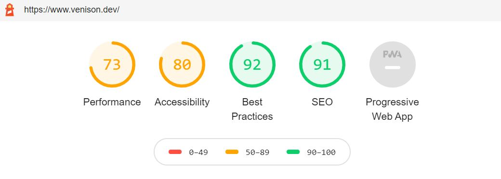
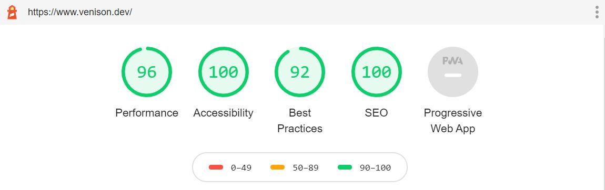

## A week in words  

This week I put my head down and focused on Front End Wizard and did a few touch ups to venison.dev to improve accessibility and speed, Front end wizard is on the last leg of development now so expect a release in the next couple of days!

## Project Chat

Minor updates to venison.dev and big progress on front end wizard!

### Venison.dev 

Front end wizard has taken a large chunk of my week this week leaving only small bits of time here and there for other projects. That being said I thought I would spend a little bit of time raising the Google lighthouse score from its current value!

The Lighthouse report wasn't the worst but I knew it could be miles better. Below is the report it gave me and then the steps I had to make to get it in the green.

**Initial Lighthouse report for Venison.dev**


Accessibility:

- Font color legibility, I had some green anchor tags on a white background which were not very easy to see. I changed them to a deeper purple to make them more legible.
- Meta viewport tag. I removed the `user-scalable=no, initial-scale=1.0, maximum-scale=1.0, minimum-scale=1.0` from the string as many people depend on the ability to zoom in and out to view text on their device.

Best Practices:

- This one required me to put `rel="noopener"` on anchor tags with `target="_blank"` to prevent the new page from being able to access the window.opener property, a small security fix. 

SEO:

- I forgot to add a meta description, so I added one!
- robots.txt. I used the <a href="https://www.npmjs.com/package/parcel-plugin-static-files-copy" target="_blank">parcel-plugin-static-files-copy</a> plugin to create a static directory and added a robots.txt file into it

Performance:

- Render blocking css, This was caused by google fonts and the 2 local css files I linked in the `index.html` file! For this I navigated directly to `https://fonts.googleapis.com/css2?family=Open+Sans:wght@300;400;700&display=swap`, copied it out. Combined it with my small amount of css, minified it all and put it between style tags. The rest of the css is scoped so I could leave SvelteJS to handle that.
- Images, The thing I forget to do, every, single, time. for this I installed `parcel-plugin-imagemin` and added the following config:

```javascript
//imagemin.config.js /root 
module.exports = {
    "gifsicle": { "optimizationLevel": 2, "interlaced": false, "colors": 10 },
    "mozjpeg": { "progressive": true, "quality": 10 },
    "pngquant": { "quality": [0.25, 0.5] },
    "svgo": {
        "plugins": [
            { "removeViewBox": false },
            { "cleanupIDs": true },
        ]
    },
    "webp": { "quality": 10 }
}
``` 

Not a lot of changes but they made the difference!

**Updated Lighthouse report for Venison.dev**
After the changes mentioned above the new lighthouse looks like below!



Still a few tweaks to be made to hit 100 accross the board but for now this will suffice!

### Front End Wizard

I have gone against what I said I would do... already. I started building the API. Last time I did this project I said I would build an API and never got round to it so this time im not risking that and have started the API, looks like I will be building them in tandem!

If you look at the <a href="https://trello.com/b/aIKttr7S/front-end-wizard" target="_blank">Board</a> this week you will see I have made significant progress on the API and the front end project. The API is also in <a href="https://github.com/kieranmv95/Front-End-Wizard-API" target="_blank">Github</a> if you want to take a look.

On the API side technology I went for:
- NodeJS
- TypeScript
- Express
- MongoDB

These are all familiar technologies to me (except for TypeScript), so it gives me a comfortable standing to make progress.

I am using Heroku to host the API and I have provisioned an mLab one click mongoDB instance through Heroku too. This is all free up to around 1GB of mongo storage, so I highly <a href="https://www.heroku.com/" target="_blank">recommend checking it out</a> for your side projects too. 

The start of the week was all setup, configuring Heroku and the initial API project. Once that was done it was plain sailing. I have created all the endpoints I need for the MVP project which include:
- `POST category`
- `GET category`
- `POST link`
- `GET link`
- `GET link/:id`

I have since hooked all these up into the front end project! I am now working on final tweaks, and a fair amount of error handling. This project **will be live** before next Wednesday! I will keep everyone updated via <a href="https://twitter.com/kieranmv95" target="_blank">Twitter</a>.

## Week Coding Breakdown

Check out <a href="https://wakatime.com/" target="_blank">Wakatime</a> to find out what your coding breakdown is!

Coding stats for the last 7 days `(usage > 5% && extension !== '.md')`:

|Language|Percentage|Description|
|---|---|---|
|.ts|**59%**|So much TypeScript this week|
|.jsx|**19%**||
|.json|**6%**||
|.md|**5%**||

## Hot picks

Every week I pick out a few cool resources I have recently found and share them here! 

- <a href="https://www.heroku.com/" target="_blank">Heroku</a> - Heroku is a platform as a service (PaaS) that enables developers to build, run, and operate applications entirely in the cloud. This is what I am using for Front End Wizard rebuild!    
- <a href="https://www.netlify.com/" target="_blank">Netlify</a> - Deploy modern static websites with Netlify. Get CDN, Continuous deployment, 1-click HTTPS, and all the services you need. I also used this for front end wizard! so easy to set up.  

## Off topic

Outside of working I have not really done much this week! I went to the driving range at the weekend but other than that I have been crunching on front end wizard to get it shipped!

I think next week as soon as it's released I'm going to have a couple of relaxed evenings, watch some disaster films or something.