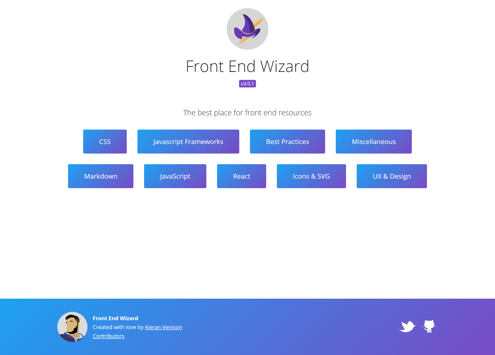

## A week in words  

It's been a busy week. In the last week I got Front End Wizard released, a grand total of around 5 weeks of on and off work but its out!

In my work life I'm in the process of moving clients whilst also using a mac for the first time for development. So all together this means it's been a busy week.

Not touched any other code relating to personal projects or upskilling this week as I needed a few days to reset and figure out what's next.

## Project Chat

This week its only progress on one project! but its big progress.

### Front End Wizard

Finally, released the rebuild of <a href="https://www.frontendwiz.co.uk/">Front End Wizard!</a> so check it out!

For more information I did a small article dedicated to front end wizard covering its new features and what's to come, [check it out here](/articles/2020/april/front-end-wizard/)

If you want to dive into the code check out the repos:

- <a href="https://github.com/kieranmv95/Front-End-Wizard" target="_blank">Front End React Project</a>
- <a href="https://github.com/kieranmv95/Front-End-Wizard-API" target="_blank">Back End NodeJS Project</a> 

One thing sprung up as I was writing this article which will bite me in few months. The free one click mlab mongodb instance I used for Front End Wizard through heroku is being discontinued in November so I will need to find a new service to do this on! Could potentially be my chance to start looking into AWS. 

**Wrap it up**

It's been a fun journey! I rebuilt this project because primarily it needed a rebuild, the old code was horrendous. But secondly to prove I could finish a project! It's easy to have ideas and projects you want to build but so many fall apart when you actually start, you just got to stick to it and release something.

During the process of building this I have had a good shot at learning TypeScript too, and I must say, I love it! So this will be something I use in future applications.

Going forward I am using this weekly newsletter as I am now, a general update on what I am doing but also a form of accountability to get projects done. Even if only 2 people read this it means 2 people can see I'm failing when I don't carry on with a project!

## Week Coding Breakdown

Check out <a href="https://wakatime.com/" target="_blank">Wakatime</a> to find out what your coding breakdown is!

Coding stats for the last 7 days `(usage > 5% && extension !== '.md')`:

|Language|Percentage|Description|
|---|---|---|
|.ts|**40%**||
|.jsx|**18%**||
|.md|**22%**||
|.scss|**8%**||
|.json|**5%**||

## Hot picks

It's time to wave goodbye to the Hot Picks section 👋. With the release of front end wizard this section has become redundant!

Check out <a href="https://www.frontendwiz.co.uk/" target="blank">Front End Wizard</a> to see every hot pick you could want!  

## Off topic

With the start of the week being late night grinds to get Front End Wizard finished the end of the week was more about relaxing and taking a break.

Since releasing I have done one minor update to Front End Wizard and then resorted to lazing about and thinking of potential next projects. I have plenty of time to think about them with Storm Francis keeping me couped up! So stay tuned for next week as I start my next project!

Until next week. 